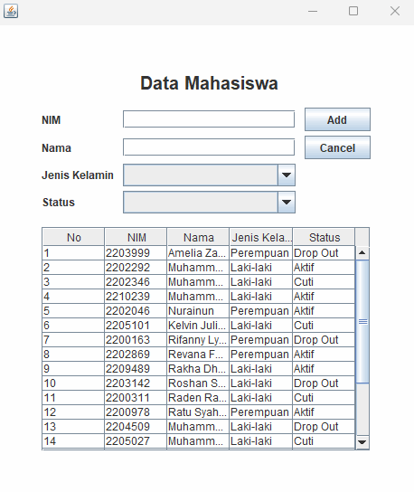
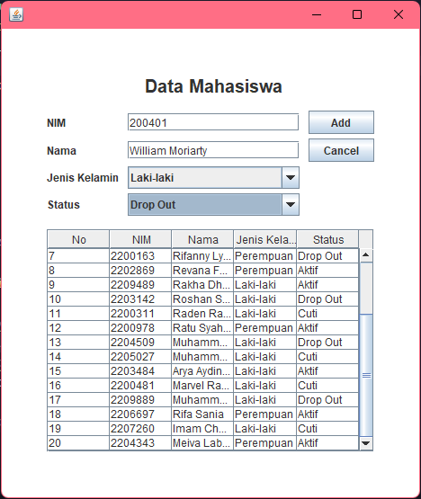

# Janji
Saya Yusrilia Hidayanti dengan NIM 2306828 mengerjakan Tugas Praktikum 4 dalam mata kuliah Desain dan Pemrograman Berorientasi Objek untuk keberkahanNya maka saya tidak melakukan kecurangan seperti yang telah dispesifikasikan. Aamiin.

# Desain Program
Program ini adalah aplikasi berbasis GUI yang dibuat menggunakan Java Swing untuk mengelola data mahasiswa. Mahasiswa memiliki 5 atribut yaitu No, NIM, Nama, Jenis Kelamin (Laki-laki/Perempuan) dan Status (Aktif/Cuti/Dropout).

Program ini dapat melakukan:

1. Menampilkan Data

    Data mahasiswa ditampilkan dalam tabel yang berisi NIM, Nama, Jenis Kelamin, dan Status.

2. Menambahkan Data

    User dapat memasukkan data baru ke dalam sistem dengan mengisi form yang terdiri dari NIM, Nama, Jenis Kelamin (**ComboBox**), dan Status (**ComboBox**), lalu menekan tombol **Add**.

3. Mengedit Data

    Ketika user mengklik baris dalam tabel, data yang dipilih akan dimuat ke dalam form, tombol **Add** berubah menjadi **Update**, dan tombol **Delete** menjadi terlihat. User dapat mengubah data lalu menyimpannya dengan menekan **Update**.

4. Menghapus Data

    User dapat menghapus data setelah memilih baris di tabel dan menekan tombol **Delete**, yang akan menampilkan konfirmasi sebelum penghapusan dilakukan.

# Penjelasan Alur

1. Inisialisasi & Tampilan Awal

   - Membuat objek Menu.    
   - Window ditampilkan dengan ukuran 480x560 px.    
   - Data mahasiswa awal di-load menggunakan `populateList()`.    
   - Tabel dibuat menggunakan `setTable()` dengan data dari `listMahasiswa`.    
   - Komponen UI seperti `ComboBox` dan tombol diatur sesuai kebutuhan.

2. Menambahkan Data

    - User mengisi NIM, Nama, Jenis Kelamin, dan Status di form input.    
   - Menekan tombol **Add** akan memanggil `insertData()` yang:    
     - Mengambil data input dari form.    
     - Menambahkan data ke `listMahasiswa`.    
     - Memperbarui tabel dengan `setTable()`.    
     - Mengosongkan form dengan `clearForm()`.    
     - Menampilkan pesan sukses.

3. Memilih dan Mengedit Data

    - Saat baris dalam tabel diklik, `mousePressed()` menyalin data dari tabel ke form input.    
   - Tombol **Add** berubah menjadi **Update**, dan tombol **Delete** muncul.    
   - Jika user menekan **Update**, `updateData()` akan memperbarui data di `listMahasiswa`, memperbarui tabel, membersihkan form, dan menampilkan pesan sukses.

4. Menghapus Data

    - Jika user menekan tombol **Delete**, akan muncul dialog konfirmasi.    
   - Jika memilih Yes, `deleteData()` akan menghapus data dari `listMahasiswa`, memperbarui tabel, mengosongkan form, dan menampilkan pesan sukses.

5. Membatalkan/Mereset Form

    - Menekan tombol Cancel akan memanggil `clearForm()`, yang:    
      - Mengosongkan semua field input.    
      - Menyembunyikan tombol **Delete**.    
      - Mengembalikan tombol **Update** menjadi **Add**.    
      - Mengatur `selectedIndex` kembali ke -1 (tidak ada baris yang dipilih).

# Dokumentasi

### Program sedang berjalan

### Tampilan utama program

